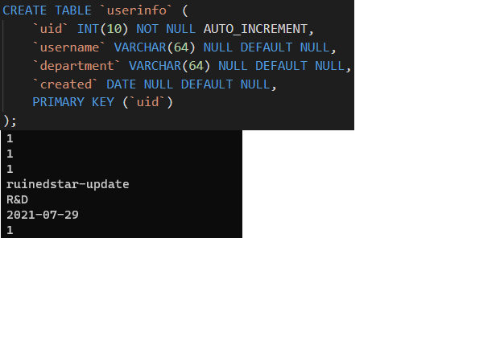

# Web-Application-with-Go

This is a project for praticing building web applications with Go language.

# Quickstart

``` bash
# For an example go run ./Chap3.2/main.go
go run ./Chap{x}/main.go
```
* Require a web browser. (Edge, Chrome or Firefox, etc.)

|                                                                                                             |                                           Results                                            |                                                                                                   |
| :---------------------------------------------------------------------------------------------------------: | :------------------------------------------------------------------------------------------: | :-----------------------------------------------------------------------------------------------: |
| Chapter 3.2 <br/>  <br/> Build a simple web server | Chapter 4.1 <br/>   <br/> Process form inputs | Chapter 4.2 <br/>  <br/> Verification of inputs |
|        Chapter 4.4 <br/>  <br/> Duplicate submissions        |           Chapter 4.5 <br/> <br/> File upload           |

* Require packages to install. 
  * MySQL (Chapter 5.2)
  * MongoDB (Chapter 5.6)

|                                                             |                                     Results                                     |       |
| :---------------------------------------------------------: | :-----------------------------------------------------------------------------: | :---: |
| Chapter 5.2 <br/>  <br/> MySQL | Chapter 5.6 <br/>  <br/> NoSQL database |  |

# Reference

https://github.com/astaxie/build-web-application-with-golang